## Easy BlueMap Sign Markers & Lines

Japanese version: [README_ja.md](README_ja.md)

This plugin lets you place signs in-game and display both markers and lines on BlueMap.

This plugin is based on the unmaintained [BlueMapSignMarkers](https://modrinth.com/plugin/bluemapsignmarkers), and also extends [EasyBlueMapSignMarkers](https://modrinth.com/plugin/easy-bluemap-sign-markers) with additional features and quality-of-life improvements.

Tested server: Paper
Probably works on: Folia / Spigot / Purpur

## Setup
You need to have **BlueMap** installed on your server. The plugin depends on it.
If you already have **BlueMap**, put the jar file into `plugins` folder on your server... and that's it!

On startup, legacy marker files are copied from `/plugins/EasyBMSignMarkers/marker-set-<world>.json` into this plugin folder and then migrated to `marker-set-<world>.yml`.

## Config
You can configure the tag wrappers used on sign line 1 in `plugins/EasyBlueMapSignMarkersAndLines/config.yml`.

- `startprefix`: start wrapper for sign tags
- `endprefix`: end wrapper for sign tags

Defaults:

- `startprefix: "="`
- `endprefix: "="`

With defaults, valid examples are `=map=`, `=BMLine=`, `=BMLineUnder=`.

## Edit mode (show hidden marker signs)
By default, marker signs are hidden. You can reveal them per-player only while editing.

Behavior:

- Edit mode is **player-specific**.
- While edit mode is ON, marker signs are visible to that player.
- While edit mode is OFF, marker signs are hidden for that player.
- If you try to place/interact on a location where a marker sign exists while edit mode is OFF, the action is canceled and a warning message is shown.

## How to use
Place any sign in the game. Fill the sign as follows:

- **1st line**: `=marker_icon_name=` (please see [Marker names](#marker-names) for available name tags)
- **2nd line:** text
- **3rd line:** text
- **4th line:** text

First line **MUST** be filled. If the 1st line does not contain a valid name, but still uses configured wrappers, the fallback value `map` is assigned.
At least one of lines 2-4 must contain text. If all are empty, the marker is not created.
Do not put spaces inside wrapped tags (valid with defaults: `=map=`, invalid: `= map =`).

## Example
Below example will create marker on your map with `star` icon assigned.

First, you build the sign

After a while, you will see the marker on your BlueMap

And when you click it - the popup containing your sign description will appear

## BMLine (connect multiple signs with a line)
You can also create a line marker by linking multiple signs.

Fill signs as follows:

- **1st line**: `=BMLine=` or `=BMLineUnder=`
- **2nd line**: line ID (e.g. `road-main`)
- **3rd line**: order number (e.g. `1`, `2`, `3`)
- **4th line**: optional color code (`#RRGGBB` or `#RRGGBBAA`)

How it works:

- Points are grouped by line ID and sorted by the numeric order.
- If a line has **2 or more points**, a BlueMap `LineMarker` is rendered.
- If a point-sign is broken and the line drops below 2 points, the line marker is removed.
- Rendering mode is decided by the first point (lowest order):
- If the first point is `=BMLineUnder=` (with default wrappers), the whole line is rendered as underground style (not hidden by terrain).
- If the first point is `=BMLine=` (with default wrappers), the whole line uses normal style.
- Line color is also decided by the first point (lowest order):
- If first point line 4 has `#RRGGBB`, the whole line uses that RGB with default alpha.
- If first point line 4 has `#RRGGBBAA`, the whole line uses that RGBA (including alpha override).
- Invalid color values fall back to default line color.

Notes:

- Line IDs are scoped per world.

Notes:

- There are currently no other plugin commands.
- Existing sign workflows (`=icon=`, `=BMLine=`, `=BMLineUnder=` with default wrappers) are event-driven and do not require commands.

## Permissions

| Permission | Default | Description |
|---|---|---|

| `easybmsignmarkers.edit` | op | Allows using `/bmedit` to show hidden marker signs |

Notes:

- No additional permission nodes are required for placing or removing sign markers in the current implementation.

## Marker names
These are the names that are available for the markers, plus the corresponding icons. Just use any of the values between brackets - `[` and `]`, e.g. `[bank]` - to place the marker on the **BlueMap**.
It does not matter if you use lowercase or uppercase. The plugin will handle it.

| Name         |                                Icon                                 | Note           | Name        |                                                               Icon                                                                | Note           |
|--------------|:-------------------------------------------------------------------:|----------------|-------------|:---------------------------------------------------------------------------------------------------------------------------------:|----------------|
| anchor       |              |                | key         |                                         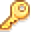                                         |                |
| bank         |                  |                | king        |                                        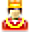                                        |                |
| basket       |              |                | left        |                                        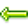                                        |                |
| bed          |          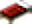          |                | lightbulb   |                                                                      |                |
| beer         |         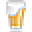         |                | lighthouse  |                                                                    |                |
| bighouse     |     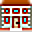     |                | lock        |                                                                                |                |
| blueflag     |          |                | **map**         |                                                                                  | Fallback value |
| bomb         |                  |                | minecart    |                                    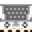                                    |                |
| bookshelf    |        |                | offlineuser |                                                                  |                |
| bricks       |              |                | orangeflag  |                                                                    |                |
| bronzemedal  |    |                | pinkflag    |                                                                        |                |
| bronzestar   |   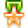   |                | pirateflag  |                                                                    |                |
| building     |          |                | pointdown   |                                                                      |                |
| cake         |         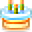         |                | pointleft   |                                                                      |                |
| camera       |              |                | pointright  |                                                                    |                |
| cart         |                  |                | pointup     |                                     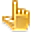                                     |                |
| caution      |            |                | portal      |                                      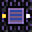                                      |                |
| chest        |                |                | purpleflag  |                                                                    |                |
| church       |              |                | queen       |                                                                              |                |
| coins        |                |                | redflag     |                                                                          |                |
| comment      |            |                | right       |                                       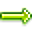                                       |                |
| compass      |            |                | ruby        |                                                                                |                |
| construction |  |                | scales      |                                                                            |                |
| cross        |        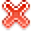        |                | shield      |                                                                            |                |
| cup          |                    |                | sign        |                                                                                |                |
| cutlery      |            |                | silvermedal |                                 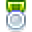                                 |                |
| diamond      |            |                | silverstar  |                                                                    |                |
| dog          |                    |                 | skull       |                                                                              |                   |
| door         |                  |                | star        |                                                                                |                |
| down         |                  |                | sun         |                                                                                  |                |
| drink        |                |                | temple      |                                                                            |                |
| exclamation  |    |                | theater     |                                                                          |                |
| factory      |            |                | tornado     |                                     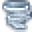                                     |                |
| fire         |                  |                | tower       |                                       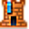                                       |                |
| flower       |       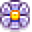       |                | tree        |                                                                                |                |
| gear         |         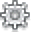         |                | truck       |                                                                              |                |
| goldmedal    |    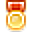    |                | up          |                                                                                    |                |
| goldstar     |          |                  | walk        |                                                                                |               |
| greenflag    |        |                | warning     |                                                                          |                |
| hammer       |       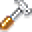       |                | world       |                                                                              |                |
| heart        |                |                | wrench      |                                                                            |                |
| house        |                |                | yellowflag  |                                                                    |                |

The images used are modified versions of original Dynmap assets. You can find them here:

- [Dynmap on github](https://github.com/webbukkit/dynmap)
- [Original resources](https://github.com/webbukkit/dynmap/tree/v3.0/DynmapCore/src/main/resources/markers)
