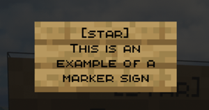
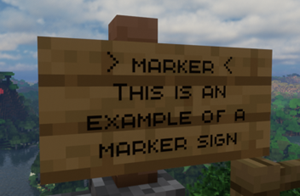
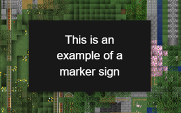

## Easy BlueMap Sign Markers & Lines（日本語版Readme）

このプラグインは、ゲーム内で看板を設置するだけで BlueMap 上にマーカー・ラインを表示できるプラグインです。

本プラグインは、現在メンテナンスされていない [BlueMapSignMarkers](https://modrinth.com/plugin/bluemapsignmarkers) をベースにした、[EasyBlueMapSignMarkers](https://modrinth.com/plugin/easy-bluemap-sign-markers) をさらに改良・機能追加したプラグインです。

動作確認サーバー: Paper
多分動く: Folia / Spigot / Purpur

## セットアップ

- サーバーに **BlueMap** が導入されている必要があります（必須依存）。
- BlueMap 導入済みなら、本プラグインの jar を `plugins` フォルダへ入れるだけで利用できます。

## 編集モード

デフォルトではマーカー看板は非表示です。編集時だけプレイヤー単位で表示できます。

- 編集モードは **プレイヤー単位** です。
- ON のプレイヤーにはマーカー看板が表示されます。
- OFF のプレイヤーにはマーカー看板が非表示になります。
- OFF のまま看板が設置されている位置へ設置/操作を試みると、操作はキャンセルされ警告メッセージが表示されます。

## 通常マーカーの使い方（アイコン付き POI）

看板を以下の形式で記入します。

- **1行目**: `[marker_icon_name]`（利用可能な名前は [Marker names](README.md#marker-names) を参照）
- **2行目**: テキスト
- **3行目**: テキスト
- **4行目**: テキスト

注意:

- 登録成功後、1行目は `> marker <` に置き換わります。
- 1行目は必須です。
- 2〜4行目は少なくとも1行、何らかの入力が必要です（全部空だと作成されません）。
- 1行目が `[` `]` 形式で無効名の場合はデフォルト値 `[map]` が使用されます。

## 通常マーカーの例

登録成功後:

BlueMap 上の表示:

クリック時の詳細ポップアップ:

## BMLine（複数看板を線で接続）

複数の看板を同じ line ID で管理し、順番付きで LineMarker を描画します。

記入形式:

- **1行目**: `[BMLine]` または `[BMLineUnder]`
- **2行目**: line ID（例: `road-main`）
- **3行目**: 順番（整数、例: `1`, `2`, `3`）
- **4行目**: 任意（現状未使用）

挙動:

- line ID ごとに点を管理し、順番（整数）で並べ替えます。
- 点が2つ以上あると BlueMap の `LineMarker` が描画されます。
- 点が2未満になると、対応するラインは BlueMap から削除されます。
- line ID はワールドごとに独立管理です。
- データは `line-data-<world>.yml` に記録されます。
- 描画モードは先頭点（最小 order）で決まります。
- 先頭点が `[BMLineUnder]` の場合、その line 全体が「透過 + 地形に隠れない」表示になります。
- 先頭点が `[BMLine]` の場合、通常表示になります。

## コマンド

| コマンド | 説明 | 使い方 |
|---|---|---|
| `/bmedit` | マーカー看板の編集モードを切り替える | `/bmedit [on|off|toggle]` |

補足:

- 現状のプラグインコマンドは `/bmedit` のみです。
- `[icon]` / `[BMLine]` / `[BMLineUnder]` の登録はイベント駆動（看板操作）で動作し、コマンド不要です。

## 権限

| 権限ノード | デフォルト | 説明 |
|---|---|---|
| `easybmsignmarkers.edit` | op | `/bmedit` の実行を許可 |

## Marker names（アイコン一覧）

- アイコン名と対応画像の一覧は英語版 README の同セクションを参照してください。
- 値はそのまま看板1行目で使えます（例: `[bank]`, `[star]`）。

参照: [README.md の Marker names](README.md#marker-names)

## 画像素材について

利用している画像は Dynmap 素材の改変版です。

- [Dynmap on github](https://github.com/webbukkit/dynmap)
- [Original resources](https://github.com/webbukkit/dynmap/tree/v3.0/DynmapCore/src/main/resources/markers)

## ダウンロード

- [Modrinth](https://modrinth.com/project/easy-bluemap-sign-markers)
